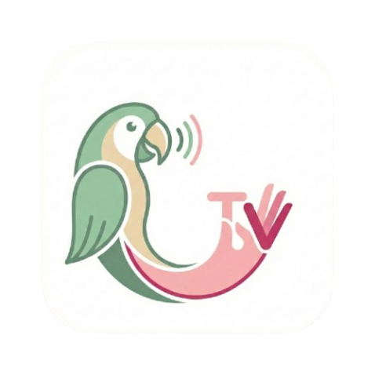

# Parrot

<p align="center">
  
</p>

Parrot is a cutting-edge Flutter application designed to bridge the communication gap for individuals using sign language. It provides real-time, context-aware sign-to-speech translation with personalized voice cloning technology.

##  Features

- **Dynamic Sequence Recognition (V2)**: Uses **LSTM (Long Short-Term Memory)** neural networks to recognize not just static hand shapes, but fluid movements and sentences over time.
- **Holistic Spatial Awareness**: Powered by **MediaPipe Holistic**, tracking hands, body pose, and facial landmarks simultaneously to distinguish between signs performed at different body locations.
- **Voice Studio**: Create and manage personalized AI voice clones that sound just like the user using Real-Time Voice Cloning.
- **Bi-Manual Support**: Native support for two-handed signs, enabling a more natural and complete sign language vocabulary.
- **Interactive HUD**: An editable transcription area that allows users to refine translated text before speaking it out via the cloned voice.
- **Premium UI**: A sleek, dark-themed interface built with Flutter's latest Material 3 components and Lucide icons.

## 🛠 Tech Stack

- **Frontend Framework**: [Flutter](https://flutter.dev) (Dart)
- **State Management**: Flutter Riverpod
- **Backend Framework**: Flask (Python) with Socket.IO for real-time streaming.
- **AI/ML Logic**:
  - **Tracking**: MediaPipe Holistic (Pose + Hands + Face)
  - **Classification**: TensorFlow Lite (LSTM for Sequences, Dense for Static Keypoints)
  - **Voice Cloning**: Real-Time Voice Cloning (RTVC) with Encoder/Synthesizer/Vocoder architecture.
  - **TTS**: Parrot/SYSPIN personalized synthesis.

---

##  Getting Started

### Prerequisites

- **Flutter SDK** (Latest Stable)
- **Python 3.10+**
- **MediaPipe & TensorFlow**
- **CUDA/GPU** (Optional, highly recommended for real-time voice cloning)

### Step 1: Backend Setup

1.  Navigate to the backend directory:
    ```bash
    cd backend
    ```
2.  Install Python dependencies:
    ```bash
    pip install -r requirements.txt
    ```
3.  Download required AI models:
    ```bash
    python download_models.py
    ```
4.  Run the server:
    ```bash
    python server.py
    ```

### Step 2: Application Setup

1.  Intall Flutter dependencies:
    ```bash
    flutter pub get
    ```
2.  Run the application:
    ```bash
    flutter run
    ```

---

## AI Model Training Guide (V2)

Parrot V2 supports two types of recognition: **Static** (Single frame) and **Sequence** (Temporal movement). For complex words and sentences, use the **Sequence** workflow.

### **Workflow A: Sequence Recognition Algorithm (The "New" Way)**
*Ideal for dynamic signs, two-handed movements, and sentence-level recognition.*

#### **Phase 1: Label Configuration**
1.  Open `backend/video/model/keypoint_classifier/keypoint_classifier_label.csv`.
2.  Add your new sign/word to the list. Note the index (e.g., Line 20 = ID 19).

#### **Phase 2: Data Acquisition Algorithm**
1.  Run the sequence collector:
    ```bash
    python backend/video/sequence_collector.py
    ```
2.  **Initialization**: The script initializes **MediaPipe Holistic** to track 543 total landmarks.
3.  **Capturing**:
    - Select your target class using keys `0-9` or `a-i`.
    - **Hold 'K'** while performing the sign.
    - **Step-by-Step Logic**: 
        - The script captures a burst of **30 consecutive frames**.
        - For each frame, it extracts 33 Pose landmarks, 21 Left Hand, and 21 Right Hand landmarks.
        - Landmarks are flattened and concatenated into a 258-feature vector per frame.
        - After 30 frames, the entire sequence (30x258) is saved as a `.npy` file in `backend/video/model/sequences/`.
4.  **Variability**: Capture at least **30-50 sequences** per word from different angles and speeds to ensure model robustness.

#### **Phase 3: Neural Network Training**
1.  Run the LSTM trainer:
    ```bash
    python backend/video/train_sequence_classifier.py
    ```
2.  **Training Logic**:
    - **Preprocessing**: Loads all `.npy` files and splits them into training (80%) and testing (20%) sets.
    - **Architecture**: Builds a **Sequential LSTM Model** (64 units -> 32 units -> Dense -> Softmax).
    - **Optimization**: Uses `Adam` optimizer and `SparseCategoricalCrossentropy` loss.
    - **Export**: Once accuracy > 90%, it automatically converts the Keras model to `sequence_classifier.tflite`.

#### **Phase 4: Deployment**
1.  Restart `python backend/server.py`.
2.  The server automatically detects the new `.tflite` file and activates the **Temporal Detection Worker**.

### **Workflow B: Static Recognition (Hand Shapes)**
*Best for alphabets or simple static gestures.*

1.  **Collect Data**:
    ```bash
    python backend/video/keypoint_collector.py
    ```
2.  **Train Classifier**:
    ```bash
    python backend/video/train_classifier.py
    ```

---

##  Project Structure

*   **`backend/`**:
    *   `server.py`: Main entry point with SocketIO streaming.
    *   `video/`: Holistic/LSTM recognition modules.
    *   `clone/`: Real-time voice cloning engine.
*   **`lib/`**:
    *   `screens/home`: Real-time Hub for translation.
    *   `screens/voice_studio`: Interface for active voice cloning.
    *   `screens/learning`: Educational modules for ASL learners.

---
